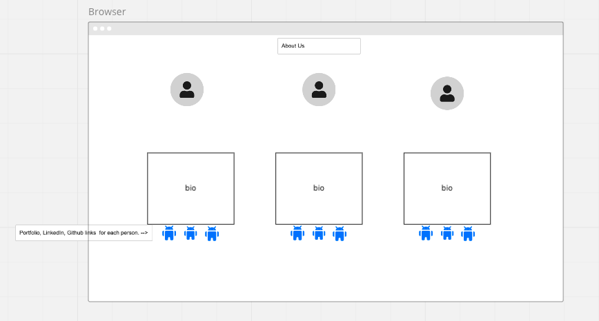
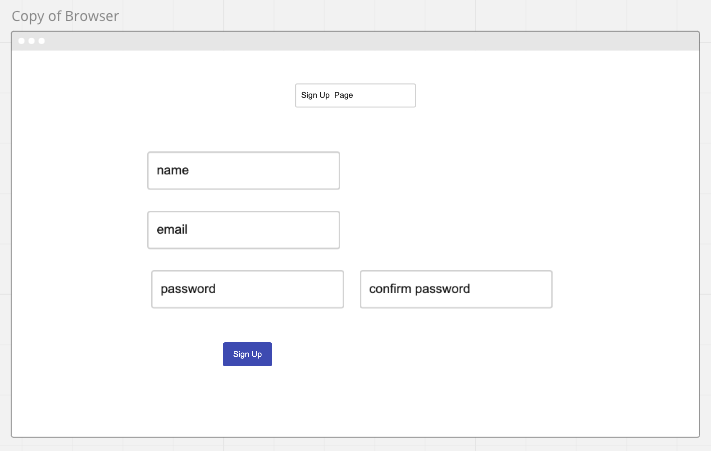
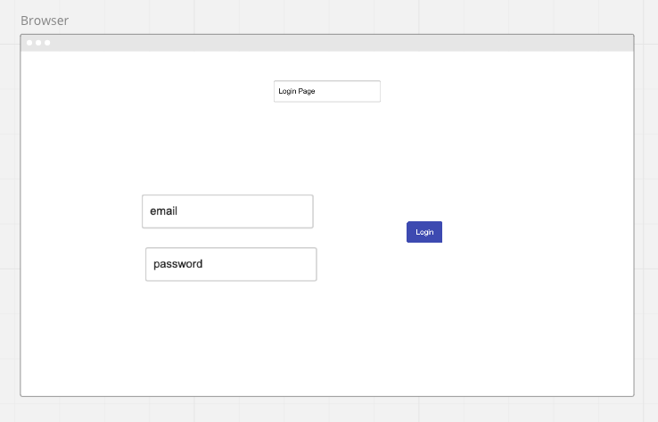
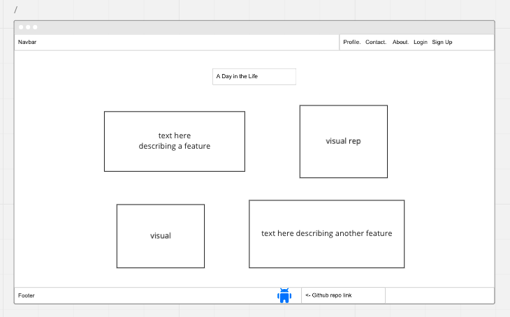
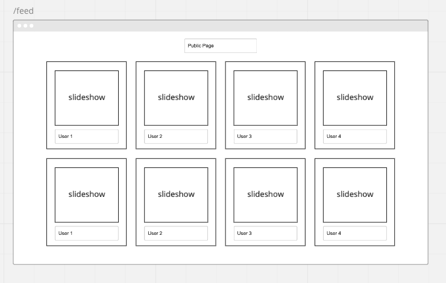
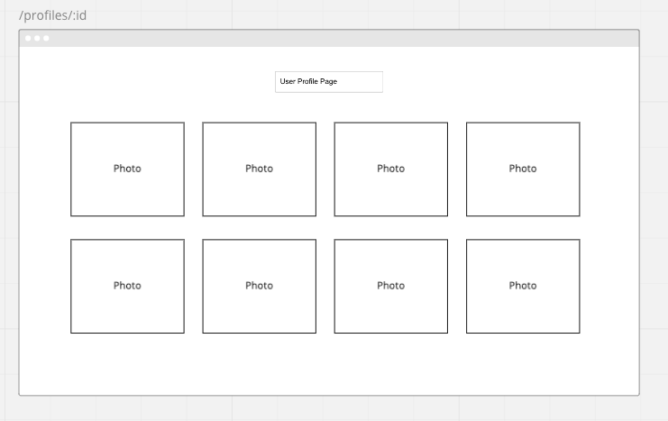
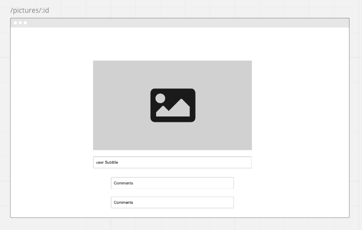
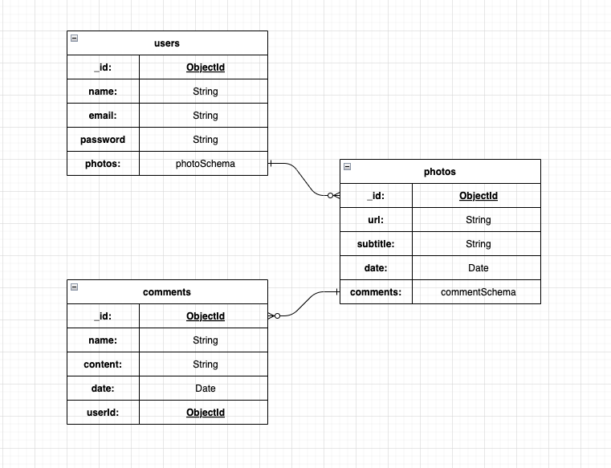

# A Day in the Life

A day in the life is a MERN stack application. Link to server repository https://github.com/danieldenton/day-in-life-server

# What is it?

Do you ever miss the early days of social media? When each application focused more on user needs and less on pumping out a fancy new feature to keep up with their competition? A Day in the Life is a website that aims to make casual photo sharing more engaging again. This app shows you a feed of different users, with a slideshow of their posts, rather than an endless scroll of advertisements and sponsored posts designed to maximize your screen past what you originally intended. This is based off the idea of engaging with the profile of specific users, to get a more in depth view of what is going on in a day in the life of the individual person. Once clicking on their profile, you will be given a list of all the photo's they've shared. All of these images will be clickable, allowing you to view the picture and share your thoughts!

# API Choice

The API we chose to use is Cloudinary. We will be using this API to allow users to upload photos to their feed. Cloudinary will allow a user to upload a photo and add it to the database. We then receive JSON data that allows us to display the image that was uploaded.

# Restful Routing Chart - back-end

| **CRUD** | **URL**                | **DESCRIPTION**                         |
| -------- | ---------------------- | --------------------------------------- |
| POST     | /api-v1/users/register | Adds a new user to database             |
| POST     | /api-v1/users/login    | Logs in the user, sends back a token  |
| GET      | /api-v1/users/:id      | Reading user document corresponding to ID |
| GET      | /api-v1/feed       | Reads all user documents with picture subdocs|
| POST     | /api-v1/pictures | Creates picture subdoc in current user document|
| GET      | /api-v1/pictures/:id   | Read picture document corresponding to ID |
| PUT      | /api-v1/pictures/:id   | Updates picture caption corresponding to ID|
| DELETE   | /api-v1/pictures/:id | Delete individul picture post corresponding to ID|
| POST     | /api-v1/comments       | Add comments to an individual picture    |
| PUT      | /api-v1/comments/:id   | Updates comment corresponding to ID       |
| DELETE   | /api-v1/comments/:id   | Deletes comment corresponding to ID       |

# Restful Routing Chart - front-end

| **CRUD** | **URL**                | **DESCRIPTION**                         |
| -------- | ---------------------- | --------------------------------------- |
| GET     | /        |  Renders a landing page                               |
| GET     | /login   | Renders a login form                                  |
| GET      | /register     | Renders a register form                       |
| GET      | /about         | Renders an About page with bio components     |
| GET     | /feed     | Renders all users with slideshow component            |
| GET      | /profiles/:id  | Renders specific user with all photo component |
| GET      | /pictures/:id   | Renders photo detail page with comments component|
| GET      | /pictures/new   | Renders a photo upload form |
| GET      | /pictures/:id/edit   | Renders a caption update form |

# Wireframes

Click to show

- About us page
  
- Sign up page
  
- Login page
  
- Public landing page
  
- Public feed page
  
- Profile page
  
- Details page

# ERD

# User Stories

- As a user without an account, I would like to register with my name, email, and password.
- As a user without an account, I would like to see a page that explains what a day in the life is, and how it would be useful.
- As a user who finished registration, I would like to be able to sign into my created account.
- As a user who is signed in, I would like to be able to sign out of my account.
- As a user I want to post photos to my profile, so I can see and share them later.
- As a user I would like to edit any post I have already made.
- As a user I would like to delete any post I have already made.
- As a user I want to be the only one who can edit or delete my post.
- As a user I want to click on others profiles, so I can see the posts they've made.
- As a user I want to click on an individual picture of another user to see more information.
- As a user I would like to comment on a individual picture to share my thoughts.
- As a user I would like to be able to delete a comment I wrote.
- As a user I would like to be able to edit a comment I wrote.

# MVP goals

- Sign up and sign in functionality.
- User authentication with encrpyted passwords.
- CRUD functionality for a users post
- User autherization for comment update and delete.
- User autherization for post update and delete.
- Layout for signed in user home page showing all users with a slideshow of their pictures.
- Layout for unregistered user home page showing the concept of the app, and how it would be useful.

# Stretch Goals

- Add private profiles
- Add private photos
- Have the layout of the signed in user resemble a polaroid.
- Change password
- CRUD for comments on posts.
- Add ability to favorite a user
